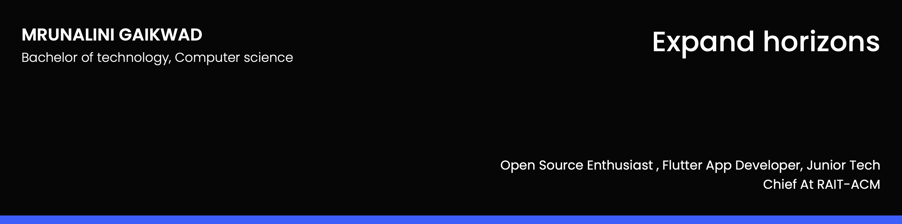

## 🧔 About Me

- 🔭 I’m currently a Master's of Software Engineering student at University of Irvine, California 

- 🌱 I’m currently learning **Flutter, Django, and more**

- 👯 I’m looking to collaborate on **Android and Full stack Projects**

- 📝 I am an **open source Enthusiast**

- 📫 Contact me **[here](gaikwadmrunalini@gmail.com)**

## 🤝 Connect

